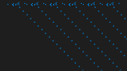

# Conway's Game of Life Wallpaper

This wallpaper generate a generation of a Conway's Game of Life which grow over time and saved through restart

### Installation

There is 3 importants files that you will use for installation: `editor.py`, `config.json`, `board.txt`.

- `editor.py` is used to convert an image to a board
- `board.txt` is where the board is stored for next generation
- `config.json` is the main config file you'll need to modify

Before setting up a cronjob you need to create a board, you can either hardcode it (hard) or make it from an image with `editor.py`. Then, you can modify `config.json` to make it compatible with your screen. The current config use a 256x144 canvas for a 2560x1440 screen.


### Running

After changing the `config.json`, you can setup a cronjob that will run every X

```bash
* * * * * python main.py
```

But this alone with only create a new wallpaper every minutes, on Linux, the command to change the wallpaper depends on your DE, for GNOME it's the following: `gsettings set org.gnome.desktop.background picture-uri file://ABS_PATH_TO_IMG.png` (add a `&&` between the two commands)


### Gallery

